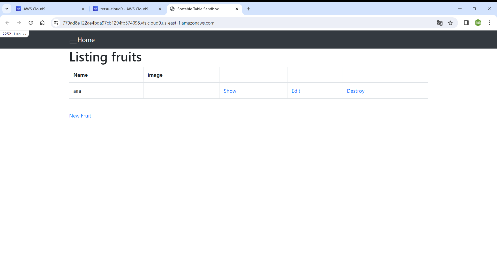
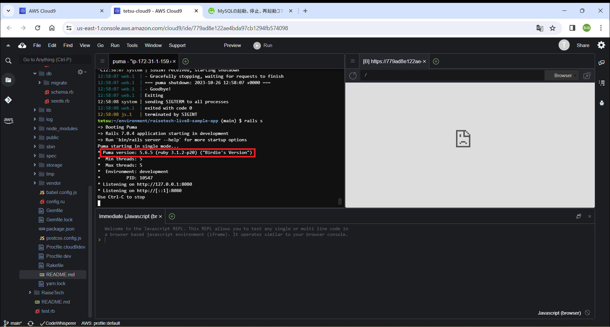
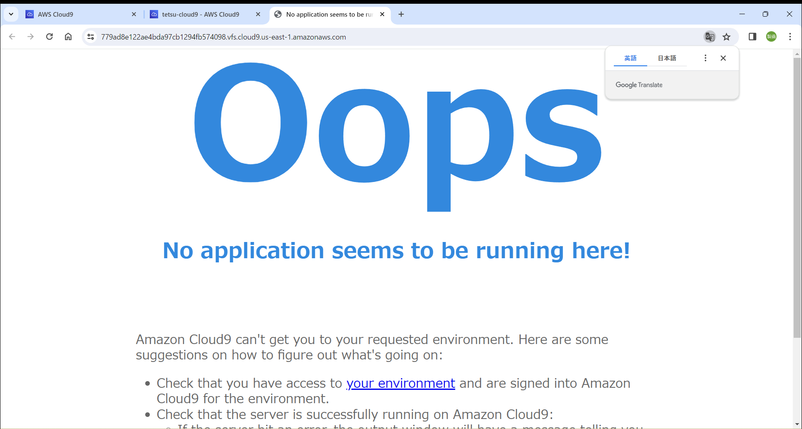
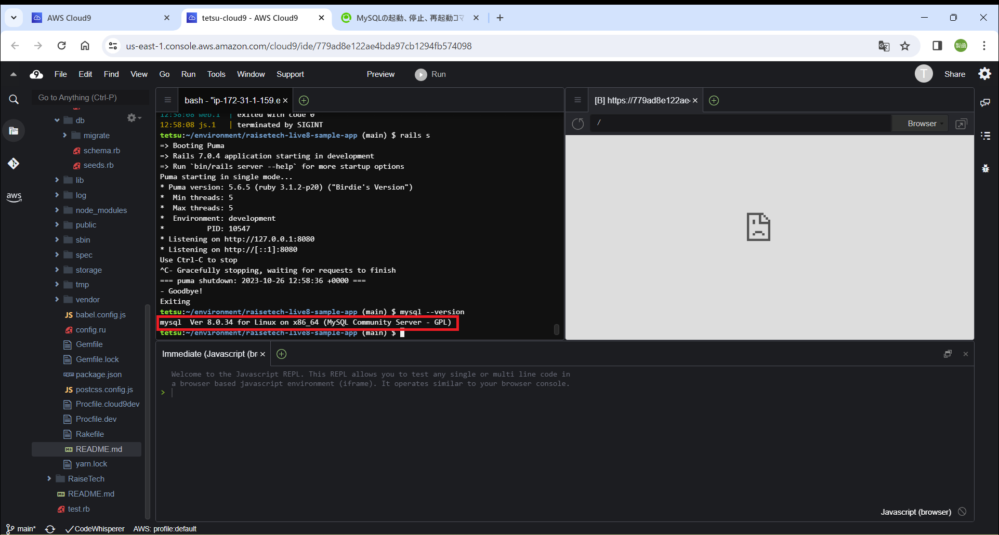
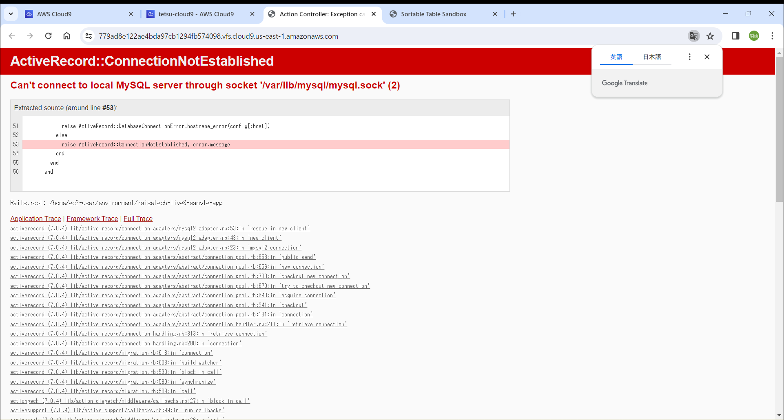
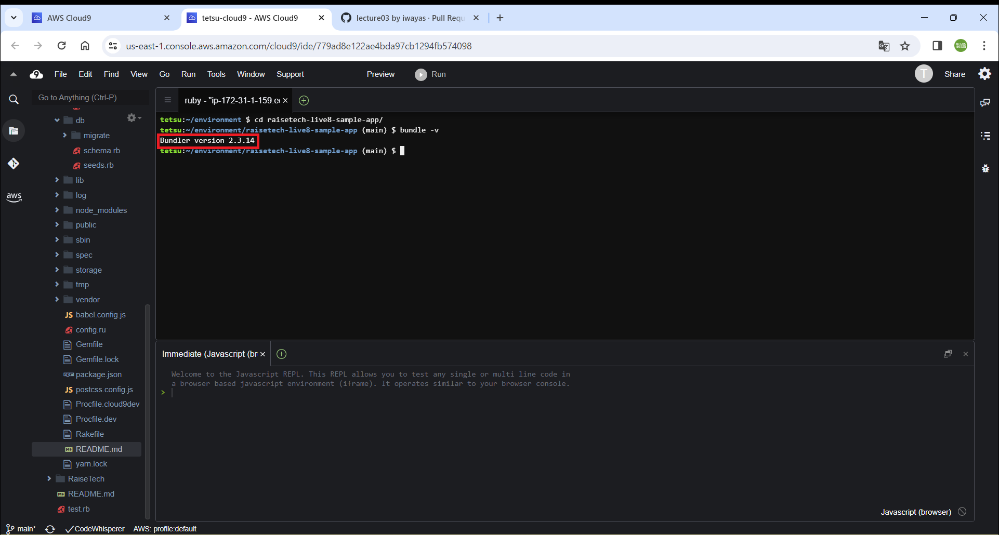

### 課題3について
- AP サーバーの名前とバージョンを確認とアクセス。  
→AP サーバー:Puma、バージョン:5.6.5  
  

- AP サーバーを終了させた場合、引き続きアクセスできるか？結果を確認して、また AP サーバーを起動。  
→出来ない。確認後APサーバーを起動した。  

- サンプルアプリケーションで使った DB サーバー（DB エンジン）の名前と、今 Cloud9 で動作しているバージョンはいくつか確認。  
→DB サーバー:MySQL、バージョン:8.0.34  
  

- Rails の構成管理ツールの名前  
→Bundler  

- 今回の課題から学んだこと  
サンプルアプリケーションを起動するにはrubyやSQLだけでなくnode、yarnをインストールしなければならないことがわかった。
またdatabase.ymlの編集などが必要であった、完全には理解はできていないが、手を動かして理解を深めていきたい。