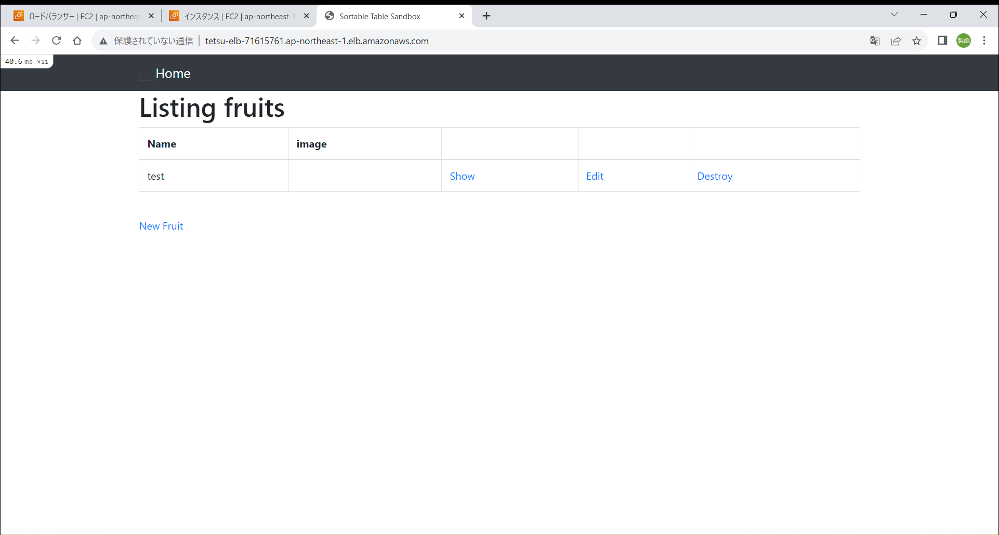

### 課題5について
#### EC2上にサンプルアプリケーションをデプロイして動作させる  


##### 1.環境構築  

- gitをインストール  
````
sudo yum update  
sudo yum install git  
````
- ec2にサンプルアプリをcloneする  
````
git clone https://github.com/yuta-ushijima/raisetech-live8-sample-app  
````
- パッケージをインストール  
````
sudo yum -y install gcc-c++ make patch git curl zlib-devel openssl-devel ImageMagick-devel readline-devel libcurl-devel libffi-devel libicu-devel libxml2-devel libxslt-devel
````
- rbenv をインストール  
````
git clone https://github.com/sstephenson/rbenv.git ~/.rbenv  
````
- ~/.bash_profile に bin の位置を登録する。パスを通す(どのディレクトリからもアプリケーションを呼び出せる状態にする)  
````
echo 'export PATH="$HOME/.rbenv/bin:$PATH"' >> ~/.bash_profile
````
- ~/.bash_profile に rbenv コマンドが使えるように登録する。rbenvを呼び出すための記述  
````
echo 'eval "$(rbenv init -)"' >> ~/.bash_profile  
````
- 先ほど設定したものを再読み込みする  
````
exec $SHELL -l  
````
- rbenv のバージョンを確認する  
````
rbenv --version  
````
- rubyをインストール    
````
git clone https://github.com/sstephenson/ruby-build.git ~/.rbenv/plugins/ruby-build  
````
- rehash を行う    
````
rbenv rehash  
````
- rbenv のバージョンのリストを確認する  
````
rbenv install --list  
````
- ruby3.1.2をインストール  
````
rbenv install 3.1.2 --verbose  
````
- 3.1.2を使用するように設定する  
````
rbenv global 3.1.2  
````
- rehash を行う  
````
rbenv rehash  
````
- ruby のバージョンを確認する  
````
ruby -v
````
- Rails(7.0.4)をインストール  
````
gem install rails -v 7.0.4  
````
- Node.js(17.9.1)をインストール  
````
nvmをインストール  
curl -o- https://raw.githubusercontent.com/nvm-sh/nvm/v0.39.5/install.sh | bash  
nvmを有効化  
. ~/.nvm/nvm.sh  
````
- Node(17.9.1)をインストール  
````
nvm install 17.9.1  
````
- yarnのインストール  
````
npm install --global yarn  
````
- Bandler(2.3.14)をインストール  
````
gem install bundler -v 2.3.14  
````
- インスタンス作成初期からインストールされているMariaDB用パッケージを削除する。  
````
sudo yum remove mariadb-*  
````
- MySQLのリポジトリをyumに追加する  
````
sudo yum localinstall https://dev.mysql.com/get/mysql80-community-release-el7-5.noarch.rpm  
````
- MySQLに必要なパッケージ(mysql-community-server)を取得する  
````
sudo yum install --enablerepo=mysql80-community mysql-community-server  
````
- 下記コマンドを実行してMySQLに必要なパッケージ(mysql-community-devel)を取得する  
````
sudo yum install --enablerepo=mysql80-community mysql-community-devel  
````
- 下記コマンドを実行してインストールされたMySQLに関係のあるパッケージを出力する  
````
yum list installed | grep mysql  
````
- 下記コマンドを実行してlogファイルを作成する  
````
sudo touch /var/log/mysqld.log  
````
- 下記コマンドを実行してmysqldを起動する  
````
sudo systemctl start mysqld  
````
- 下記コマンドを実行してmysqldがインスタンスの起動と同時に起動するように設定する  
````
sudo systemctl enable mysqld  
````
- database.ymlを作成、RDSのエンドポイント/ユーザー名/パスワードを登録  
````
database.yml（config/database.yml.sampleのコピー）を作成  
cp config/database.yml.sample config/database.yml  
````
- config/database.ymlの中身を編集  
````
vi config/database.yml  
default: &default  
adapter: mysql2  
encoding: utf8mb4  
pool: <%= ENV.fetch("RAILS_MAX_THREADS") { 5 } %>  
username: RDS作成時に設定したユーザー  
password: RDS作成時に設定したパスワード   
host: RDSのエンドポイント  
````
- 組み込みサーバー(Puma)でのサンプルアプリケーション動作確認  
````
bin/setup  
bin/dev  
````
- インバウンドルールに3000ポートを追加  
http://IPアドレス:3000/でアクセス  
  


##### 2.Nginx設定
- amazon linux extrasでNginxをインストール  
````
sudo amazon-linux-extras install nginx1  
````
- 自動起動の設定 
````
sudo systemctl enable nginx  
````
- nginxの起動  
````
sudo systemctl start nginx.service  
````
- nginxの状態確認  
````
sudo systemctl status nginx  
````
- EC2のインバウンドルールに80ポートを追加  

- Nginxの設定ファイルを編集する  
````
　sudo vim /etc/nginx/nginx.conf  
　以下を記述  
　upstream unicorn {  
　server unix:/var/www/[アプリケーション名]/tmp/sockets/unicorn.sock;  
　}  
````
- ec2-userにnginxの実行権限を付与  
````
cd /var/lib  
sudo chmod -R 775 nginx  
````
- 設定を保存し終えたら、Nginxを再起動して新しい設定を適用  
````
sudo systemctl restart nginx  
````
- nginxが正常に動作していることを確認  
````
sudo systemctl status nginx  
````
http://パブリックIPv4アドレス/でアクセス  
  


##### 3.Unicornを設定
- Gemfileを編集  
````
cd raisetech-live8-sample-app  
vim Gemfile  
group:development do  
  gem 'unicorn'  
end  
````
- bundleをインストール  
````
bundle install  
````
- Unicornを起動  
````
bundle exec unicorn_rails -c config/unicorn.rb -E development -D  
````
- Unicorn起動確認  
````
ps -ef | grep unicorn | grep -v grep  
````
- http://パブリックIPv4アドレス/でアクセス  
  


##### 4.ELBを追加  
- ターゲットグループ作成  
  
- セキュリティグループ作成  
  
- ロードバランサー作成  
  

- config/environments/development.rbを編集  
````
cd raisetech-live8-sample-app/config/environments  
vi development.rb  
config.host << "ELB(ALB)のDNS名"  
````
- NginxとUnicornを再起動  
- DNS名でアクセスしアプリケーションが起動するか確認  
  

##### 5.S3追加  
- バケットを作成  
  
- IAMロールを作成し、Amazon S3へのアクセスをEC2に割り当てる  
  
- config/storage.ymlの設定を変更
````
vim storage.ymlの設定を変更
amazon:
  service: S3
  access_key_id: Access key ID
  secret_access_key: Secret access key
  region: リージョンコードの指定
  bucket: バケット名
````
- config/environments/development.rbの設定を変更  
````
vim development.rb
config.active.storage.service:amazon
````
- アプリケーションへの画像アップロード  
  

- S3から確認  
  


- 削除
````
aws s3 rm s3://tetsu-bucket/test/apple.png
````

##### 6.構成図  
  

##### 感想  
第5課題はかなり難易度が高く感じた。  
迷いながら調べながら何とかここまで出来た。  
1か月半もかかってしまった。  
構成図を書いて理解が深まった。  
構成図を書くことの重要性だとわかった。  