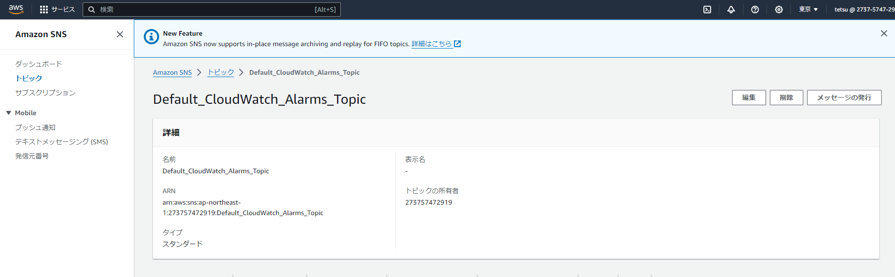

# 課題6について
## 1.CloudTrail  
- 見つけたイベント:StopInstances  
インスタンスを停止した際のイベント  
  
- イベントソース:ec2.amazonaws.com  
- 発信元 IP:アドレス:106.155.59.70  
- イベント ID:2cd8743b-b33b-4269-99cf-75c62956cfa6  
  
## 2.CloudWatch  
- Amazon SNS  
  
- アラーム設定  
  
- ロードバランサーのヘルスステータスが異常でメール受信  
  

  
- ロードバランサーのヘルスステータスが正常でメール受信  
  

  

## 3.コスト管理  
- [見積り](https://calculator.aws/#/estimate?id=b8744aa5d69b54085c4f8d4802584cf43eef9c6d)  
- 現在の利用状況  
 
- 先月の利用状況  
  

 

## 感想    
OKアクションの際にメールを飛ばす設定が分からず時間がかかってしまった。  
多少時間がかかってしまったが理解が深まった。
