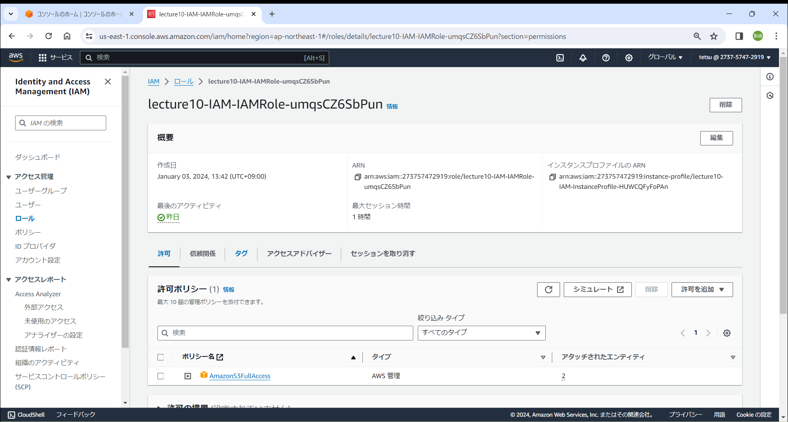

# 課題10について
## CloudFormation を利用して、現在までに作った環境をコード化する。  
## コード化ができたら実行してみて、環境が自動で作られることを確認する。

### スタック作成
- VPC、セキュリティグループ、EC2、ALB、RDS、IAM、S3毎にテンプレートを作成した。  
- 上記記述の順で実行した。  
  

### 実行結果
- VPC  
  
- EC2用のセキュリティーグループ  
  
  
- ALB用のセキュリティーグループ  
  
  
- RDS用のセキュリティーグループ  
  
  
- EC2  
  
  
- ALB  

- RDS  
  
- IAM  
  
- S3  
  

### 感想
- テンプレートを作成する際はコンソールの設定画面を見ながらすることによって理解が深まった。
- IAMのテンプレートを実行後、EC2にどのようにIAMロールを付与すればいいか時間がかかった。  
  EC2のテンプレートにIAMロールの設定を追記して更新したら出来た。本来は最初にEC2のテンプレートを実行する前にIAMのテンプレートを実行するのが望ましいと感じた。
  しかし、更新の方法が勉強になったのでよかった。
- インデントが正しくないとエラーになってしまうので、VScodeにindent-rainbowをインストールして対応した。