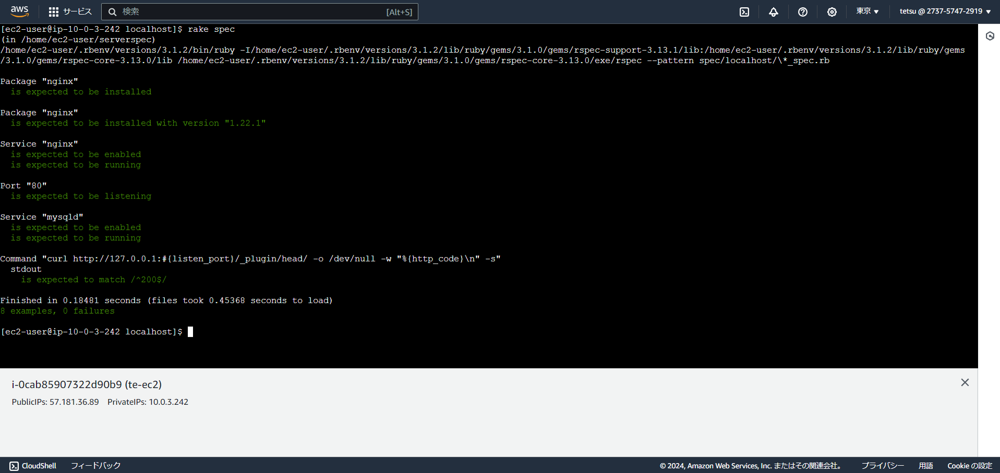

# 課題11について
## ServerSpec のテストが成功すること  

### ServerSpecの環境構築  
- 作業用ディレクトリを作成して移動  
````
mkdir serverspec  
cd severspec  
````

- ServerSpecインストールする  
````
gem install severspec  
severspec-init  
以下のように指定  
Select OS type:  
  1) UN*X  
Select a backend type:
  2) Exec (local)
````
### テストファイルを編集する
- 以下のファイルを編集する(サンプルファイルを置換)  
/home/ec2-user/serverspec/spec/localhost/sample_spec.rb  
- 以下のように記述する  
````
require 'spec_helper'
#80番ポートを指定
listen_port = 80
#nginxがインストールされている
describe package('nginx') do
  it { should be_installed }
end
#nginxが1.22.1のバージョンを確認
describe package('nginx') do
  it { should be_installed.with_version('1.22.1') }
end
#nginxが起動している。自動起動の設定されている
describe service('nginx') do
  it { should be_enabled }
  it { should be_running }
end
#指定したポートをlistenできている
describe port(listen_port) do
  it { should be_listening }
end
# MySQLが起動している。自動起動の設定されている
describe service('mysqld') do
  it { should be_enabled   }
  it { should be_running   }
end
#curlでHTTPアクセスして200 OKが返ってくるか
describe command('curl http://127.0.0.1:#{listen_port}/_plugin/head/ -o /dev/null -w "%{http_code}\n" -s') do
  its(:stdout) { should match /^200$/ }
end
````
### 実行結果  
  

### 感想
- ServerSpecについて、どのようなツールなのか理解できた。手を動かすことは大事だと改めて感じた。  